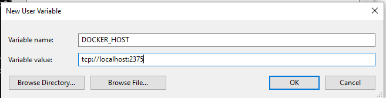

# Windows Docker Setup


## Enable Hyper-V 

Activate Virtualization via Boot Menu

Activate Windows Features

Start - Search for "Tune Windows features On & Off"

* "Hyper-V"
* "Windows Hypervisor Platforms"

image::images/activate-hypervisor-windows10.png[]


## wsl setup

check https://docs.microsoft.com/de-de/windows/wsl/install

.WSL Install in Admin CMD
```bash
wsl --install

```

.WSL Install Ubuntu in Admin CMD
```bash
wsl --install -d Ubuntu
```

Install https://docs.microsoft.com/de-DE/windows/terminal/install[Windows Terminal]

## Docker Setup

Uninstall Docker Desktop


.On WSL2:
```bash
sudo apt update && sudo apt upgrade
sudo apt remove docker docker-engine docker.io containerd runc
sudo apt install --no-install-recommends apt-transport-https ca-certificates curl gnupg2
source /etc/os-release
curl -fsSL https://download.docker.com/linux/${ID}/gpg | sudo apt-key add -
echo "deb [arch=amd64] https://download.docker.com/linux/${ID} ${VERSION_CODENAME} stable" | sudo tee /etc/apt/sources.list.d/docker.list
sudo apt update
sudo apt install docker-ce docker-ce-cli containerd.io
sudo usermod -aG docker $USER
```

### Configure docker daemon

.On WSL2:
```bash
DOCKER_DIR=/mnt/wsl/shared-docker
mkdir -pm o=,ug=rwx "$DOCKER_DIR"
sudo chgrp docker "$DOCKER_DIR"
sudo mkdir /etc/docker

sudo bash -c 'cat <<EOF >>/etc/docker/daemon.json
{
   "hosts": ["unix:///mnt/wsl/shared-docker/docker.sock", "tcp://0.0.0.0:2375"]
   "features": {
        "buildkit": true
   }
}
EOF'

## allow user to start docker daemon without password
DOCKER_DAEMON_PATH=$(which dockerd)
sudo bash -c "echo \"$USER ALL = (root) NOPASSWD: $DOCKER_DAEMON_PATH *\" >> /etc/sudoers"

## dockerd start script
cat <<EOF >>~/dockerStartup.sh
#!/bin/bash
DOCKER_DISTRO="$WSL_DISTRO_NAME"
DOCKER_DIR=/mnt/wsl/shared-docker
DOCKER_SOCK="$DOCKER_DIR/docker.sock"
export DOCKER_HOST="unix://$DOCKER_SOCK"
if [ ! -S "$DOCKER_SOCK" ]; then
   echo "Starting dockerd"
   mkdir -pm o=,ug=rwx "$DOCKER_DIR"
   sudo chgrp docker "$DOCKER_DIR"
   /mnt/c/Windows/System32/wsl.exe -d $DOCKER_DISTRO sh -c "nohup sudo -b dockerd < /dev/null > $DOCKER_DIR/dockerd.log 2>&1"
fi
EOF
chmod u+x ~/dockerStartup.sh

## start docker daemon on start - no systemd
echo "source ~/dockerStartup.sh" >> ~/.profile
```

### Testing the setup

.On WSL2:
```bash
docker run -it --rm -d -p 8080:80 --name web nginx

curl localhost:8080
```

.On Windows
```PS
start microsoft-edge:http://localhost:8080
```


### Connecting Windows Docker CLI to WSL2 Docker Daemon

Install only the docker cli on windows
```PS
choco install docker-cli
```

Connecting to wsl2 docker daemon
```PS
docker -H "tcp://localhost:2375" ps
```

Set new environment variable
DOCKER_HOST=tcp://localhost:2375


.Restart windows or just start a new Powershell
```PS
docker ps
```

## Nested virtualization in linux - to test the shit ;-)

https://docs.fedoraproject.org/en-US/quick-docs/using-nested-virtualization-in-kvm/


systemctl restart libvirtd

To enable shared clipboard
https://www.spice-space.org/download/windows/spice-guest-tools/spice-guest-tools-latest.exe

